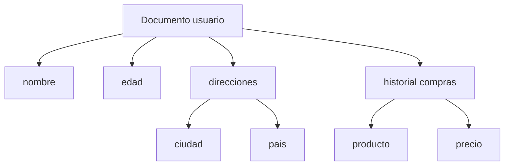

# Fundamento conceptual del modelo documental

### Características

El modelo documental parte de una idea distinta al modelo relacional.

En lugar de dividir la información en múltiples tablas relacionadas, agrupa los datos que pertenecen naturalmente a una misma entidad dentro de un único documento.

- Documentos autocontenidos
- Estructura flexible
- Campos variables entre documentos
- Soporte para estructuras anidadas
- Indexación por campos

La unidad fundamental no es la fila ni la tabla, sino el documento.

Un documento representa una entidad completa y puede contener:

- Atributos simples
- Arreglos
- Subdocumentos
- Estructuras anidadas de varios niveles
  
  Este enfoque reduce la necesidad de joins y permite que cada entidad sea autocontenida.

### Documento como unidad lógica

Un documento puede contener:

- Datos simples
- Listas
- Subdocumentos
- Campos opcionales

Ejemplo conceptual:

Usuario
nombre
edad
direcciones
historial de compras

### Representación estructural del modelo documental

### Esquema flexible

A diferencia del modelo relacional, el esquema no es obligatorio ni rígido. En una misma colección pueden coexistir documentos con diferentes campos.

Ejemplo conceptual:

Documento A
nombre
edad

Documento B
nombre
telefono
preferencias

Esto permite evolucionar el modelo sin migraciones masivas.

