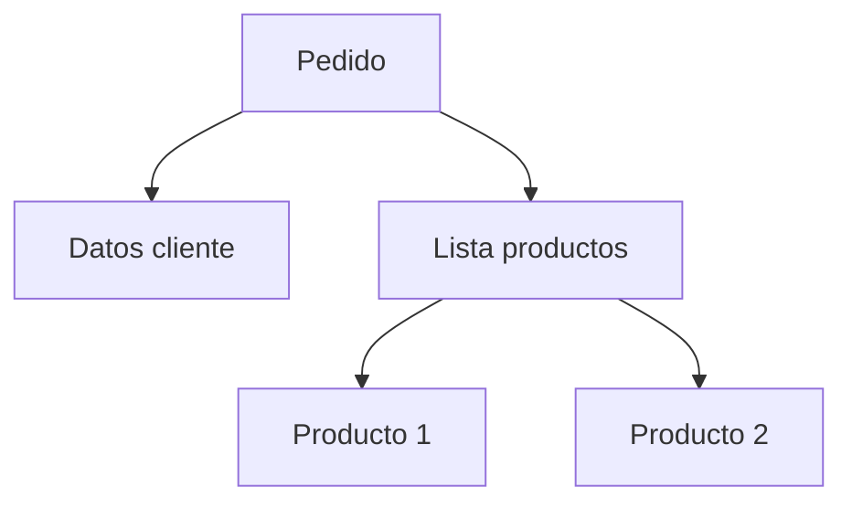

# MongoDB como implementación del modelo documental

MongoDB utiliza BSON, una representación binaria de JSON que permite:

* Tipos de datos adicionales
* Mayor eficiencia de almacenamiento
* Soporte para fechas y datos binarios

Conceptos principales:

Base de datos: contenedor lógico de colecciones
Colección: conjunto de documentos similares
Documento: estructura JSON/BSON
Campo: par clave valor dentro del documento
Índice: estructura para acelerar consultas

### Indexación

MongoDB permite indexar campos específicos dentro de los documentos.

Esto mejora:

* Consultas filtradas
* Búsquedas por rango
* Ordenamientos

Sin índices, la consulta requiere escaneo completo de la colección.

### Modelo de diseño documental

El diseño en bases documentales se basa en:

* Embedding (inserciones o incrustciones) cuando los datos están estrechamente relacionados
* Referencias cuando el volumen o reutilización lo requiere (similar a las claves foráneas del modelo relacional)

