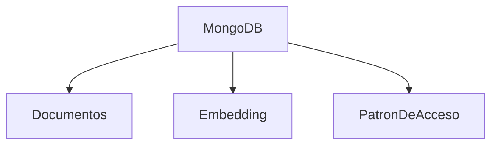
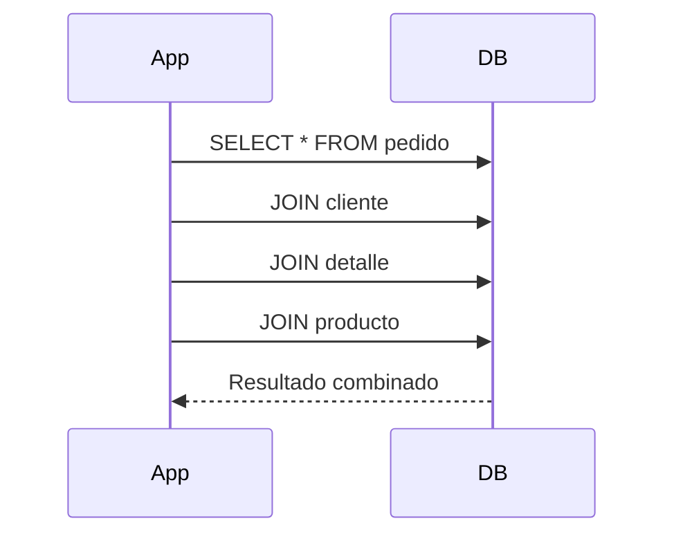
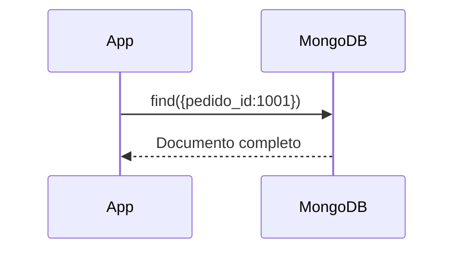

# Cambio de paradigma respecto a SQL

En bases relacionales el diseño busca:

- Normalización
- Eliminación de redundancia
- Integridad referencial estricta


En bases documentales el diseño busca:

- Optimizar lecturas reales
- Reducir consultas múltiples
- Modelar según cómo la aplicación usa los datos

La decisión afecta:

- Rendimiento
- Consistencia
- Escalabilidad
- Complejidad de consultas
  
  La pregunta ya no es “¿cómo normalizo?”
  La pregunta es “¿cómo se accede a los datos en la práctica?”
  
 ### Paradigma Relacional
  
  ```mermaid
  flowchart
    SQL --> Normalizacion
    SQL --> IntegridadReferencial
    SQL --> JOINs
  ```

### Paradigma Documental



### Flujo de consulta en BD relacional



### Flujo de consulta en BD documental



