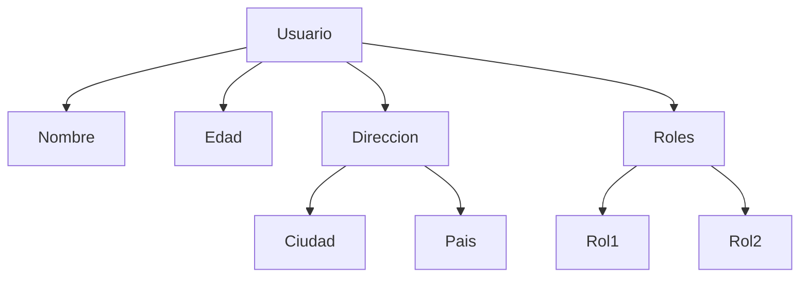
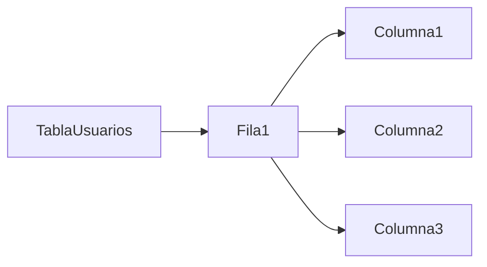

# Embedding

Consiste en incluir datos relacionados dentro del mismo documento.

[Ejemplo conceptual:](json/1-embeddings.json)

Características:

- Documento autocontenido
- Lectura completa en una sola operación
- Ideal cuando los datos siempre se consultan juntos

Ventajas:

- Lectura rápida de entidad completa
- No requiere joins
- Modelo simple

Limitaciones:

- Posible duplicación
- Crecimiento excesivo del documento

### Diagrama JSON jerárquico

### Diagrama tabular plano (relacional)

