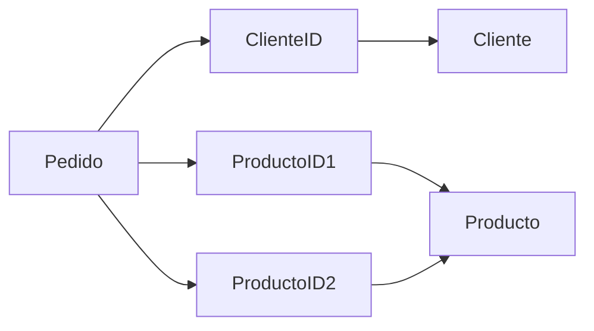

# Referencias

Consiste en almacenar documentos separados y relacionarlos mediante identificadores.

Ventajas:

- Evita duplicación
- Escalable para grandes volúmenes
- Mejor cuando los datos cambian frecuentemente

Limitaciones:

- Requiere consultas adicionales
- Mayor complejidad
- Posible pérdida de rendimiento en lectura

### Payloads de ejemplo

* [Pedido](json/2-pedido.json)
* [Cliente](json/3-cliente.json)

