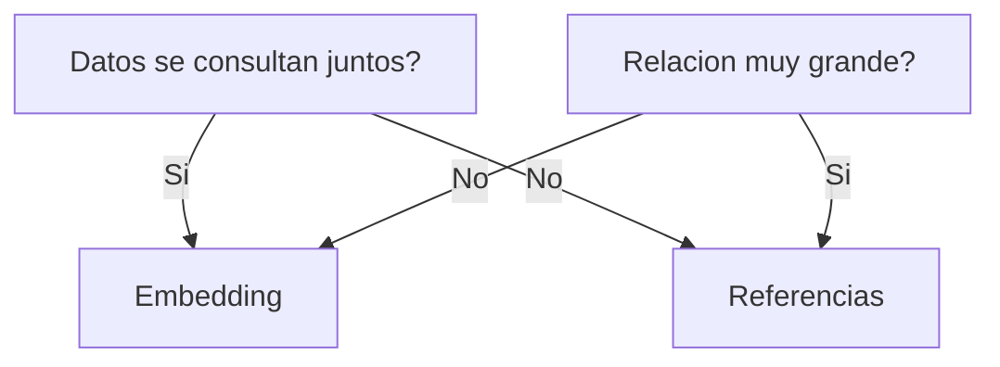

# Criterios de decisión prácticos

Usar embedding cuando:

* Relación uno a pocos
* Datos consultados siempre juntos
* Baja frecuencia de actualización independiente
* Tamaño controlado del documento

Usar referencias cuando:

* Relación uno a muchos grande
* Datos compartidos entre muchas entidades
* Actualizaciones independientes frecuentes
* Riesgo de crecimiento excesivo del documento

### Error común en diseño documental

Copiar el modelo relacional sin adaptarlo.

Eso produce:

* Documentos fragmentados
* Muchas consultas
* Pérdida de ventaja del modelo documental

