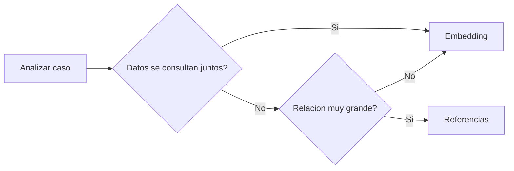

# Conclusi칩n

El modelado en MongoDB no elimina el dise침o, lo transforma.

La decisi칩n correcta depende del patr칩n de acceso.

```mermaid
flowchart LR
    Inicio[Analizar caso]
    Inicio --> ConsultaFrecuente
    ConsultaFrecuente{Datos se consultan juntos?}

    ConsultaFrecuente -->|Si| Embedding
    ConsultaFrecuente -->|No| EvaluarTamano

    EvaluarTamano{Relacion muy grande?}
    EvaluarTamano -->|Si| Referencias
    EvaluarTamano -->|No| Embedding
```

